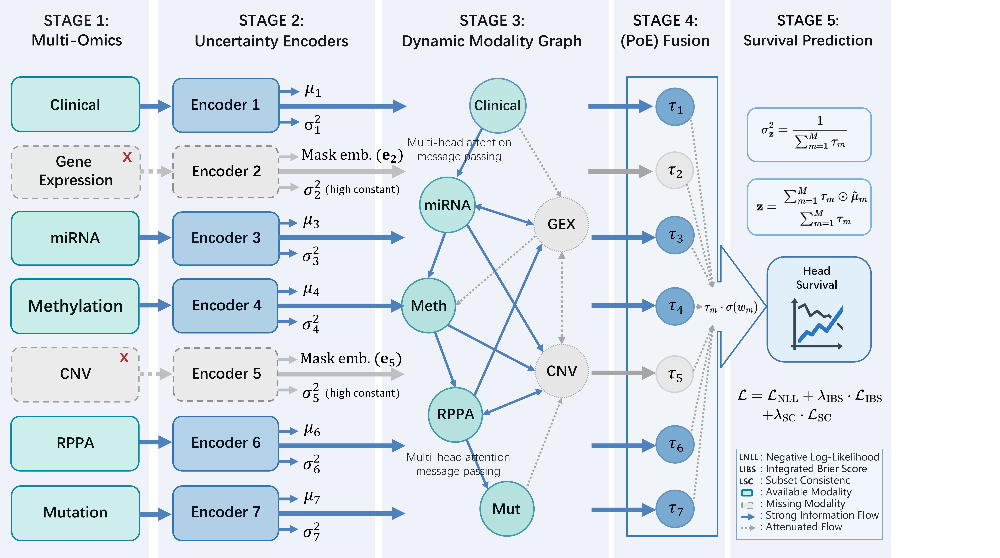

# DMG-PoE

**Robust Multi-Omics Survival Prediction with Missing Modalities via Dynamic Modality Graphs and Uncertainty-Aware Fusion**

<p align="center">
  
</p>

> **Note:** This repository is provided for peer review purposes. The code and documentation are in a pre-release state and may be updated following the review process. A stable public release will be made available upon paper acceptance.


## Overview

DMG-PoE is a deep learning framework for multi-omics cancer survival prediction that natively handles **missing modalities**. Rather than imputing absent data, the framework explicitly models input reliability through three tightly integrated components:

- **Uncertainty Encoders** — Each modality is encoded into a mean vector (&mu;<sub>m</sub>) and a log-variance (log &sigma;&sup2;<sub>m</sub>). Missing modalities are replaced by learnable mask embeddings with high variance, signaling low reliability.

- **Dynamic Modality Graph (DMG)** — A modality-level graph neural network where each omics type is a node. Multi-head attention with a missing-aware soft mask (&alpha; = 0.1) allows available modalities to provide compensatory information to missing ones while suppressing unreliable outgoing signals.

- **Product-of-Experts (PoE) Fusion** — Precision weights (&tau;<sub>m</sub> = 1/&sigma;&sup2;<sub>m</sub>) naturally down-weight missing or uncertain modalities. Learnable importance scalars &sigma;(w<sub>m</sub>) further modulate each modality's contribution.

The training objective combines three losses:
- **L<sub>NLL</sub>**: Negative log-likelihood for discrete-time survival
- **L<sub>IBS</sub>**: Approximate Integrated Brier Score for calibration
- **L<sub>SC</sub>**: Subset Consistency loss for robustness to varying modality availability

## Installation

```bash
git clone https://github.com/<your-username>/DMG-PoE.git
cd DMG-PoE
pip install -r requirements.txt
```

### Requirements

- Python >= 3.8
- PyTorch >= 1.12
- NumPy, Pandas, scikit-learn, SciPy, tqdm

## Data Preparation

This project uses the [SurvBoard](https://github.com/BoevaLab/SurvBoard) benchmark. Download the preprocessed TCGA data following their instructions and organize it as:

```
data/SurvBoard/
├── TCGA/
│   ├── BRCA_data_complete_modalities_preprocessed.csv
│   ├── BRCA_data_incomplete_modalities_preprocessed.csv
│   └── ...
└── splits/
    └── TCGA/
        ├── BRCA_train_splits.csv
        ├── BRCA_test_splits.csv
        └── ...
```

Each cancer dataset includes up to 7 omics modalities: **Clinical**, **Gene Expression (GEX)**, **miRNA**, **Methylation**, **CNV**, **RPPA**, and **Mutation**.

## Usage

### Train on a single cancer type

```bash
python train.py --cancer BRCA --folds 0 1 2 3 4 --epochs 100 --device cuda
```

### Run the full benchmark (10 cancers x 25 folds)

```bash
python run_benchmark.py \
    --cancers BLCA BRCA CESC ESCA GBM LGG LUAD PAAD SARC SKCM \
    --folds 25 --epochs 100
```

### Ablation experiments

```bash
# Without DMG (zero imputation baseline)
python run_benchmark.py --no_dmg --imputation_type zero

# Without PoE (MoE gated fusion)
python run_benchmark.py --fusion_type moe

# Without calibration losses (NLL only)
python run_benchmark.py --no_calibration

# Mean imputation instead of DMG
python run_benchmark.py --no_dmg --imputation_type mean
```

### Missing modality training

```bash
# Train with incomplete modality samples included
python run_benchmark.py --use_incomplete
```

## Project Structure

```
DMG-PoE/
├── models/
│   ├── encoder.py             # Per-modality MLP encoder (mu, log sigma^2)
│   ├── dmg.py                 # Dynamic Modality Graph (attention + soft mask)
│   ├── fusion.py              # PoE / Hybrid-PoE / MoE / Average fusion
│   ├── surv_head.py           # Discrete hazard head + NLL loss
│   └── dmg_poe_calsurv.py     # Full model + calibration losses (IBS + SC)
├── data_loader.py             # SurvBoard data loading & fold management
├── metrics.py                 # C-index, IBS, D-calibration evaluation
├── train.py                   # Single-cancer training script
├── run_benchmark.py           # Multi-cancer benchmark runner
├── figures/
│   └── fig1_framework.png     # Framework overview
├── requirements.txt
├── LICENSE
└── README.md
```

## Key Hyperparameters

| Parameter | Default | Description |
|-----------|:-------:|-------------|
| `embed_dim` | 64 | Modality embedding dimension |
| `hidden_dim` | 128 | Encoder hidden layer dimension |
| `dmg_layers` | 2 | Number of DMG propagation layers |
| `dmg_heads` | 4 | Number of attention heads in DMG |
| `num_time_bins` | 20 | Discrete time intervals for survival |
| `dropout` | 0.3 | Dropout rate |
| `lambda_ibs` | 0.1 | IBS loss weight |
| `lambda_sc` | 0.1 | Subset consistency loss weight |
| `lr` | 1e-3 | Learning rate (AdamW) |

## Citation

If you find this work useful, please cite:

```bibtex
@article{dmgpoe2026,
  title={Robust Multi-Omics Survival Prediction with Missing Modalities
         via Dynamic Modality Graphs and Uncertainty-Aware Fusion},
  author={},
  journal={},
  year={2026}
}
```

## Acknowledgements

- [SurvBoard](https://github.com/BoevaLab/SurvBoard) for the multi-omics survival benchmark and data preprocessing pipeline.

## License

This project is licensed under the MIT License. See [LICENSE](LICENSE) for details.
